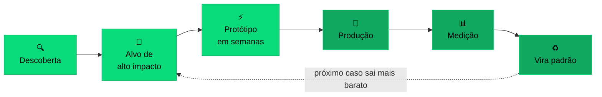

<!-- ╭──────────────────────────────────────────────────────────╮ -->
<!-- │  Paulo Sérgio Dantas · github.com/dantaspaulo            │ -->
<!-- ╰──────────────────────────────────────────────────────────╯ -->

 

  

### Sua empresa já tem IA. O que falta é ela funcionando na operação.

**Eu faço essa ponte.** Entro na operação, acho onde a IA paga, construo e deixo rodando.
 Não entrego apresentação. Entrego software no ar.

 

<table align="center">
<tr>
<td width="50%" align="center">

### 🏢 Empresas
Gente boa presa em trabalho repetitivo.
  
Automatizo o trecho de maior impacto, conectado ao que você já usa.
  
Sem trocar de ERP. Sem trocar de CRM. Sem parar.

</td>
<td width="50%" align="center">

### ⚖️ Escritórios
Advogado de formação, engenheiro na prática.
  
IA que lê documento, ajuda a redigir e conversa com o Judiciário.
  
Com sigilo, com trava e com o cuidado que a profissão exige.

</td>
</tr>
</table>

 

## 🧠 IA agêntica autônoma

**Agente não é chatbot.** São sistemas com papel definido que trabalham sozinhos,
em turno contínuo, e prestam contas do que fizeram.

<table>
<tr>
<td align="center" width="20%">🔐 <b>Menor privilégio</b></td>
<td align="center" width="20%">🤐 <b>Segredo isolado</b></td>
<td align="center" width="20%">🚦 <b>Trilho humano</b></td>
<td align="center" width="20%">🧪 <b>Trava que recusa</b></td>
<td align="center" width="20%">📋 <b>Rastro de tudo</b></td>
</tr>
</table>

O que sustenta agente em produção não é o modelo. É o governo em volta dele.

**Um engenheiro com uma frota de agentes entrega o que antes exigia um time.**

 

## 🔁 Como funciona

| Um fornecedor recebe | Um **FDE** recebe |
|:---:|:---:|
| "Construa essa funcionalidade." | **"Resolva esse problema."** |

<b>Forward Deployed Engineer:</b> engenheiro embarcado na sua operação.
Papel criado na Palantir, hoje área própria na OpenAI, inclusive no jurídico.

 

## ⚖️ FDE Legal

<table>
<tr>
<td align="center" width="33%">📄 <b>Análise de documentos</b> acervo grande, OCR difícil</td>
<td align="center" width="33%">✍️ <b>Redação de peças</b> no padrão do escritório</td>
<td align="center" width="33%">🔎 <b>Jurisprudência</b> busca na sua base</td>
</tr>
<tr>
<td align="center">🗂️ <b>Processos e prazos</b> DataJud e DJEN, do CNJ</td>
<td align="center">🛡️ <b>Sigilo e travas</b> isolamento entre clientes</td>
<td align="center">🔗 <b>Sistemas que você já usa</b> sem trocar tudo</td>
</tr>
</table>

Falar os dois idiomas evita o erro mais caro: automatizar com perfeição a etapa que não era o gargalo.

 

## 🚀 Produtos e trabalho

<table>
<tr>
<td width="50%" valign="top">

**[ChatADV](https://chatadv.com.br)** · IA para advogados
 Análise de documentos, geração de peças, jurisprudência e agentes. No ar, com clientes.

**[PostADV](https://postadv.com.br)** · conteúdo para advocacia
 Presença digital para escritórios e advogados.

</td>
<td width="50%" valign="top">

**[skills-datajud-djen](https://github.com/ChatADV/skills-datajud-djen)** · público
 APIs do CNJ empacotadas como habilidade de agente.

**[trypost](https://github.com/dantaspaulo/trypost)** · público
 Agendamento de redes sociais, open source.

</td>
</tr>
</table>

**Implantações em cliente**

`Via Cometa` · `Revizia` · `Olho Vivo` · `Potirejos` · `RN Seguro` · `Arthur IA` · `Nyxia`

46 repositórios entre a minha conta e a organização do ChatADV. A maior parte é privada.

 

## 🛠️ Stack

 

 

## 📫 Vamos conversar

**Tem uma operação para tirar do papel, ou um projeto de IA que parou na apresentação?**

Me conta o que trava hoje. Se eu não for a pessoa certa, eu digo na primeira conversa.

 

