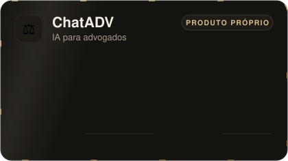
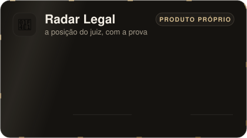
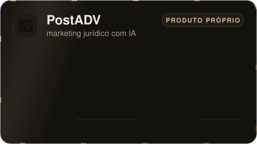
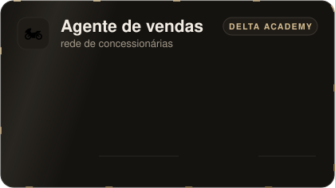
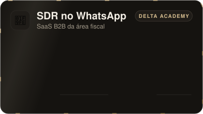
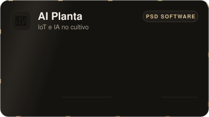
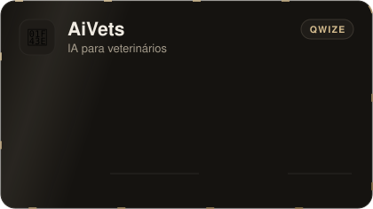
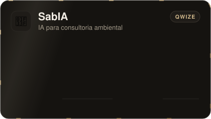
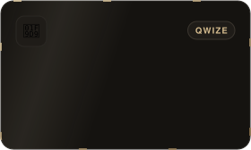

<!-- ╭──────────────────────────────────────────────────────────╮ -->
<!-- │  Paulo Sérgio Dantas · github.com/dantaspaulo            │ -->
<!-- │  Posicionamento: paulosdantas.adv.br                     │ -->
<!-- │  Cartões animados: assets/gerar.py                       │ -->
<!-- ╰──────────────────────────────────────────────────────────╯ -->

 

  

**Entendo a dor da empresa e proponho soluções acessíveis e escaláveis, com IA do diagnóstico ao resultado medido.**

 

<table>
<tr>
<td align="center" width="25%" valign="top">🧭 <b>FDE na Delta Academy</b> 8 clientes no último mês</td>
<td align="center" width="25%" valign="top">🧪 <b>FDE na QWize</b> mais 2 clientes</td>
<td align="center" width="25%" valign="top">⚖️ <b>Fundador do ChatADV</b> e do PostADV</td>
<td align="center" width="25%" valign="top">🏗️ <b>Fundador da PSD Software</b> agentes e automações</td>
</tr>
</table>

 

 

## 💼 Cases

Cliente que não autorizou o nome aparece pelo setor.

 

<b>📖 Problema, solução e resultado de cada case</b>

 

**⚖️ ChatADV** · fundador
- **Problema:** advogado perde horas em peça, leitura de processo e pesquisa; IA genérica não conhece a rotina do escritório.
- **Solução:** API, web, RAG sobre jurisprudência e documentos, agentes. A operação é conduzida por agentes, com monitoramento em 17 etapas e deploy só com teste verde.
- **Resultado:** 1 mi+ peças geradas. Produção levada do Google Cloud para VPS própria em uma semana: de ~R$ 6,7 mil para ~R$ 320 por mês.

**📡 Radar Legal** · produto do ChatADV
- **Problema:** saber como os juízes aplicam uma lei, uma tese ou um processo exige ler milhares de decisões.
- **Solução:** a IA lê cada decisão que cita o que você monitora e diz a posição do magistrado, sempre com o trecho literal que prova.
- **Resultado:** auditoria de 707 leituras com a prova conferida no texto da decisão; 30 de 30 citações confirmadas por leitura humana.

**📣 PostADV** · fundador
- **Problema:** a advocacia precisa de presença digital, não tem tempo e corre risco com as regras de publicidade da OAB.
- **Solução:** IA treinada na linguagem jurídica gera carrosséis, posts e reels, agenda nas redes e confere cada peça contra o Provimento 205/2021.

**🏍️ Agente de vendas para rede de concessionárias** · FDE na Delta Academy
- **Problema:** leads de 201 municípios em 5 estados chegam pelo WhatsApp e precisam chegar à loja e ao vendedor certos, com o contexto.
- **Solução:** agente que qualifica e simula, roteia pela área oficial das 14 lojas, registra no Salesforce com deduplicação, guarda memória por lead (com "esquecer" para a LGPD) e só sobe versão ensaiada.
- **Resultado:** 2 dias do início ao agente integrado ao Salesforce. 633 casos de teste e teste de mutação. Um ajuste de regra caiu de ~33 para ~5 minutos em ensaio.

**🧾 SDR no WhatsApp para um SaaS B2B da área fiscal** · FDE na Delta Academy
- **Problema:** pré-venda manual; o lead esperava resposta, o follow-up era irregular e o CRM ficava incompleto.
- **Solução:** agente SDR no WhatsApp oficial, com CRM por fila durável, follow-up em 5 toques, reunião na agenda do vendedor e passagem para uma pessoa no ponto certo.
- **Resultado:** no ar no primeiro dia. 641 casos de teste em 18 suítes. Manual de passagem de bastão em 10 dias.

**🌱 AI Planta** · AGI Nanotech, pela PSD Software
- **Problema:** sensores de cultivo geram dado bruto que ninguém transforma em decisão.
- **Solução:** API, aplicativo web com painéis, séries históricas e recomendações, e infraestrutura no Google Cloud. Meu papel: arquitetura, backend, interface e infraestrutura.

**🐾 AiVets** · pela QWize
- Assistente de raciocínio clínico 24 horas para veterinários, na web e no WhatsApp, com respostas ancoradas em mais de 100 mil páginas de literatura.

**🌿 SabIA** · pela QWize
- Plataforma para consultoria ambiental com 19 agentes especializados, análise de documentos com busca vetorial, estudos ambientais, CRM e assinatura.

Fontes: ChatADV · faturamento do Google Cloud, 19/09 a 02/10/2026 · Delta Academy · projetos de cliente, setembro e outubro de 2026.

 

## 🧠 Como eu trabalho

| Um fornecedor recebe | Um **FDE** recebe |
|:---:|:---:|
| "Construa essa funcionalidade." | **"Resolva esse problema."** |

**Agente não é chatbot.** O que sustenta agente em produção é o governo em volta dele.

 

## 📦 Aberto no GitHub

O resto é código de produto e de cliente: 73 dos 77 repositórios são privados (lido em 06/10/2026).

 

## 🛠️ Stack

 

  

 

## 📫 Vamos conversar

**Tem uma operação para tirar do papel, ou um projeto de IA que parou na apresentação?**

Me conta o que trava hoje. Se eu não for a pessoa certa, eu digo na primeira conversa.

 

